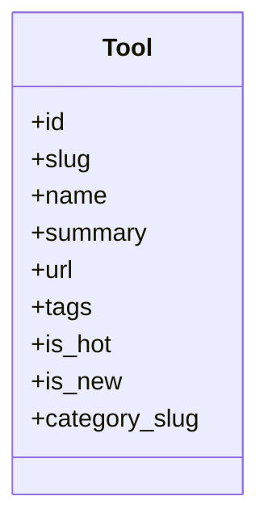

# REASONS Canvas · 工具站内详情页

- Date: 2026-10-02
- Status: synced
- Related analysis: `docs/spdd/analysis/20261002-tool-detail.md`
- Code anchors: `404home/src/router/index.js`, `404home/src/components/ToolCard.vue`, `404home/src/views/ToolDetail.vue`, `404home/src/api/index.js`

---

## R · Requirements（为什么、范围）

### Business goal

让访客在跳转第三方前，先在 404Home 内查看工具基础信息，提升导航站信息密度与可分享性。

### In scope

- 路由 `/tool/:slug`
- 详情展示：名称、summary、tags、分类名、is_hot / is_new、外链按钮
- ToolCard：标题/卡片主体进详情；保留「访问」外链
- 不存在或请求失败时的空态 + 返回

### Out of scope

- 长文章字段、相关推荐算法、后台表单改动
- HTTPS / SEO meta 专项

### Acceptance criteria

- [x] 打开 `/tool/chatgpt`（或已有 slug）展示对应工具信息
- [x] 卡片点击名称区域进入详情；「访问」仍 `target=_blank`
- [x] 错误 slug 显示空态且可回首页/分类
- [x] 视觉与现有 PostDetail / 纸感风格一致

---

## E · Entities（领域对象）

| Entity | Fields / meaning | Persistence |
| --- | --- | --- |
| Tool | id, name, slug, summary, url, tags, is_hot, is_new, category_name, category_slug | SQLite `tools`（已有） |

---

## A · Approach（方案与取舍）

### Chosen approach

前端新增详情页，调用已有 `api.getTool(slug)`；不改后端 schema。

### Alternatives considered

| Option | Pros | Cons | Decision |
| --- | --- | --- | --- |
| 仅外链 | 已实现 | 无站内深度 | 否 |
| 弹层详情 | 少路由 | 难分享 URL | 否 |
| 独立路由页 | 可分享、清晰 | +1 页面 | 采用 |

---

## S · Structure（结构与依赖）

### Modules / files to touch

| Path | Change |
| --- | --- |
| `404home/src/router/index.js` | 增加 `tool/:slug` |
| `404home/src/views/ToolDetail.vue` | 新建详情页 |
| `404home/src/components/ToolCard.vue` | 增加进详情入口 |

### Dependencies / order

1. Router 注册  
2. ToolDetail 页面  
3. ToolCard 链接  

---

## O · Operations（有序实现步骤）

### Op 1 · 注册路由

- **Files**: `404home/src/router/index.js`
- **Do**: 在 MainLayout children 增加 `{ path: 'tool/:slug', name: 'tool-detail', component: ToolDetail }`
- **Done when**: 路由表含 `tool-detail`，懒加载 `views/ToolDetail.vue`

### Op 2 · 实现 ToolDetail

- **Files**: `404home/src/views/ToolDetail.vue`
- **Do**: `onMounted`/`watch slug` 调用 `api.getTool(slug)`；展示字段与「访问官网」按钮；loading / 错误空态；返回链接用 `category_slug` 或首页
- **Done when**: 有合法 slug 时渲染完整信息；失败时不白屏

### Op 3 · 改造 ToolCard

- **Files**: `404home/src/components/ToolCard.vue`
- **Do**: 名称（或整卡主区域）`RouterLink` 到 `/tool/${tool.slug}`；底部「访问」保持外链，点击不冒泡干扰
- **Done when**: 首页/分类/搜索列表均可进详情且外链仍可用

---

## N · Norms（怎么写）

- 使用现有 CSS 变量与 `card-panel` / `btn` 模式
- Options API 或现有 setup 风格与项目一致（现有多为 setup）
- 外链必须 `rel="noopener noreferrer"`
- 不引入新依赖

---

## S · Safeguards（不许做什么）

- Must not: 前端写死工具列表；改动 SQLite schema；自动改服务器 SSH 密码
- Must not: 在详情页执行未消毒的 HTML（只用文本绑定）
- Security: 外链 `noopener`
- 不调用需登录的 admin API

---

## Sync log

| Date | Drift | Action |
| --- | --- | --- |
| 2026-10-02 | 无 | 按 Operations 实现路由 + ToolDetail + ToolCard；验收项待本地/线上点验 |
