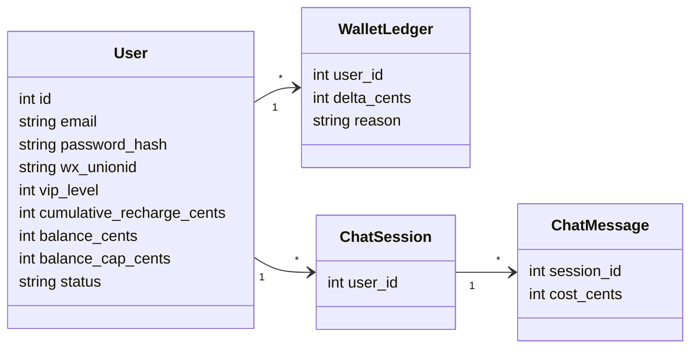

# REASONS Canvas · DeepSeek 试用总路线（响应式 Web）

- Date: 2026-10-07
- Status: draft
- Related analysis: `docs/spdd/analysis/20261007-deepseek-trial.md`
- Code anchors: `404home/server/`（auth/db/routes）、`404home/src/`（前台登录与聊天；含移动端适配）

---

## R · Requirements（为什么、范围）

### Business goal

用约 ¥100 的 DeepSeek API 额度，在 404Home 提供可控的 **桌面+手机浏览器** 模型试用；用户经 **微信（主）或邮箱+密码（备）** 注册登录；VIP 由**累充**提升；首期管理员加额，日后微信支付；邮箱与微信可绑定；会话服务端统一；账号与余额落库。**不做微信小程序**（D10）。

### In scope

- C 端用户体系（与 `admins` 分离）：邮箱、密码哈希、微信标识、状态、余额。
- 注册/登录：微信网站应用扫码；邮箱+密码+图形验证码；邮箱↔微信绑定。
- 钱包账本与扣费；DeepSeek 服务端代理。
- 响应式 Web 聊天试用（桌面 + 手机浏览器）。
- 会话/消息服务端统一（换设备同一记录）。
- 域名 + HTTPS（解析香港，首期不备案）；配置化额度；防刷与 Key 保密。

### Out of scope

- **微信小程序**及小程序类目审核（D10）。
- 短信 OTP、手机号登录。
- 首期敏感词库/人工审核流水线（D9；后续可加）。
- 多模型路由、Agent 工具调用市场。
- 替换 CMS/工具导航主站信息架构（试用作为新模块挂载）。
- 首期复杂发票/分销。

### Acceptance criteria

- [ ] 未登录无法调用模型接口。
- [ ] 余额用整数分存储；不可为负；加额不超过当前等级 `balance_cap_cents`。
- [ ] VIP 档位可配置：至少 `normal=¥3`、`vip1=¥10`、`vip2=¥20`、`vip10=¥100`；累充达标自动升档。
- [ ] 记录 `cumulative_recharge_cents`；支付与**管理员加额均计入累充**；阈值=档位额度；升档时 cap 更新且账本写入档差补额 `(new_cap - old_cap)`。
- [ ] 首期非流式对话；运营总池 Key 侧约 ¥100 由人工采购。
- [ ] 网页可完成：邮箱注册/登录或微信登录 → 对话 → 余额减少。
- [ ] 邮箱账号与微信账号可绑定；冲突时可选择合并或注销其一，完成后仅一个有效账号。
- [ ] 手机浏览器可完成登录与对话（响应式，非小程序）。
- [ ] 同一用户换设备看到一致会话/问答记录（最终一致，允许短暂延迟）。
- [ ] 生产使用 HTTPS 域名（非裸 IP）。
- [ ] DeepSeek API Key 仅存在服务端环境变量。
- [ ] 管理员登录与 C 端登录互不冒充。

---

## E · Entities（领域对象）

| Entity | Fields / meaning | Persistence |
| --- | --- | --- |
| User | id, email…, wx_unionid…, vip_level(0=normal…10), cumulative_recharge_cents, status, balance_cents, balance_cap_cents, created_at | `users` |
| VipTier（配置） | level, name, cap_cents, recharge_threshold_cents | 配置表/JSON：0→300/0；1→1000/阈值；2→2000；…；10→10000 |
| CaptchaChallenge | id, code_hash, expires_at | 内存或短表（注册用） |
| EmailToken | user_id, token_hash, purpose(verify/reset), expires_at | `email_tokens` |
| WalletLedger | id, user_id, delta_cents, reason(grant/chat/recharge/merge/admin), ref_id, created_at | `wallet_ledger` |
| ChatSession | id, user_id, title, created_at | `chat_sessions`（P2+） |
| ChatMessage | id, session_id, role, content, prompt_tokens, completion_tokens, cost_cents | `chat_messages` |
| AccountMergeEvent | from_user_id, to_user_id, operator, detail_json | `account_merge_events` |
| Admin | 现有 | `admins`（不变） |

金额约定：**一律用「分」整数**（¥3 = 300）。

---

## A · Approach（方案与取舍）

### Chosen approach

1. **同库扩展 SQLite**：新增用户/账本/会话表；管理员体系不动。
2. **双 JWT**：`role=admin` 与 `role=user` 分签或同 secret 不同 claim；中间件分 `adminRequired` / `userRequired`。
3. **模型调用**：Koa 代理 DeepSeek HTTP API；先扣费预检（余额>0），调用后按 token 结算写入账本；失败按策略回滚或记 0。
4. **身份策略（D1）**：主=微信；备=邮箱+密码；绑定后同一 `users` 行；冲突显式合并。无微信时靠邮箱。
5. **网页微信（D2）**：开放平台「网站应用」OAuth 扫码；回调须 HTTPS 域名。
6. **会话（D3）**：消息只存服务端；桌面/手机 Web 共用 chat API。
7. **客户端（D10）**：不做小程序；P4 做移动端响应式。
8. **交付顺序**：P0 邮箱 → P1 钱包 → P2 桌面 DeepSeek → P3 微信网站应用 → P4 移动 Web 适配 → P5 真充值；并行购域名+HTTPS。
9. **防刷**：注册图形验证码 + IP 限流；生产禁止模拟微信/跳过验证码。

### Alternatives considered

| Option | Pros | Cons | Decision |
| --- | --- | --- | --- |
| 前端直连 DeepSeek | 简单 | Key 泄露、无法计费 | 否 |
| 独立用户服务/Postgres | 扩展好 | 首期过重 | 否（后续可迁） |
| 短信/手机号登录 | 常见 | 成本与资质；本阶段不需要 | **否（D1）** |
| 微信 + 邮箱双通道 | 覆盖小程序与无微信用户 | 需绑定/合并逻辑 | **是（D1）** |
| 充值必须先上微信支付 | 闭环 | 资质与开发量大 | **否（D4）**：先管理员加额，P5 再上微信支付 |
| 全员同一额度上限 | 简单 | 无法做 VIP 运营 | **否（D7）**：VIP 等级 + 累充升档 |
| 仅管理员改 VIP、无累充 | 实现简单 | 与「累充升级」产品不符 | 否；支付累充为主，管理员可兜底 |

---

## S · Structure（结构与依赖）

### Modules / files to touch（预期，分阶段落地）

| Path | Change |
| --- | --- |
| `404home/server/db.js` | 新表 schema |
| `404home/server/routes/userAuth.js`（新） | 邮箱注册/登录、验证码、绑定 |
| `404home/server/routes/wallet.js`（新） | 余额查询、管理员加额 |
| `404home/server/routes/chat.js`（新） | 会话与 DeepSeek 代理 |
| `404home/server/routes/accountMerge.js`（新） | 合并/注销 |
| `404home/server/services/deepseek.js`（新） | API 客户端与计价 |
| `404home/server/services/mail.js`（新） | 验证/重置邮件（若启用） |
| `404home/server/services/captcha.js`（新） | 图形验证码 |
| `404home/server/services/wechat.js`（新） | code2session / OAuth |
| `404home/server/middleware/auth.js` | 拆分 admin/user |
| `404home/server/.env.example` | 新密钥项说明 |
| `404home/src/views/...` | 登录注册、试用聊天页 |
| `404home/src/router/index.js` | C 端路由与守卫 |
| `404home/src` 样式/布局 | P4 移动端适配 |
| Nginx / 域名 DNS | HTTPS 与反代 |

### Dependencies / order

1. Schema + email auth + captcha + user JWT（P0）
2. Wallet + ledger（P1）
3. DeepSeek proxy + web chat（P2）
4. WeChat + email bind + merge/delete（P3）
5. Mobile responsive Web（P4）
6. Payment hardening（P5）
7. 并行：域名注册 + HTTPS

---

## O · Operations（有序实现步骤）

> 本画布是**总路线**。每阶段开工前应再开子画布细化文件级步骤，再 `spdd-generate`。

### Op 1 · 冻结开放问题（产品/资质）

- **Files**: 更新本画布 Sync log + analysis 第 8 节勾选
- **Do**: 与用户逐项确认微信 AppID/主体、HTTPS 域名、邮箱验证是否强制、充值是否首期必做等
- **Done when**: 阻塞项有书面答案；非阻塞项可标「默认假设」

### Op 2 · 子画布 P0 · C 端注册登录（邮箱）

- **Files**: 新建 `docs/spdd/canvases/YYYYMMDD-user-auth-p0.md` 后实现
- **Do**: `users` 表、邮箱+密码、图形验证码、JWT user、网页注册登录 UI；与 admin 隔离
- **Done when**: 邮箱可注册登录；`/api/user/*` 需 user token

### Op 3 · 子画布 P1 · 钱包与 VIP 累充等级

- **Files**: 子画布 + `wallet_ledger`、VipTier 配置、`cumulative_recharge_cents`、admin 加额
- **Do**: 注册 `vip_level=0` 发 ¥3；加额/充值记入累充与余额；达标升档：cap←新档，余额+=档差并写 ledger；跨级按起止档一次结算
- **Done when**: 普通→VIP1 补 +7 元、普通→VIP2 补 +17 元可测；管理员加额增加累充；无负余额；余额默认不超过 cap

### Op 4 · 子画布 P2 · DeepSeek 网页试用

- **Files**: `services/deepseek.js`、`routes/chat.js`、前台聊天页
- **Do**: 代理调用、按 token 扣费、余额不足拒绝；Key 仅环境变量
- **Done when**: 登录用户网页可对话且余额下降；无 Key 时接口明确报错

### Op 5 · 子画布 P3 · 微信登录与邮箱绑定/合并/注销

- **Files**: `services/wechat.js`、绑定邮箱、合并/注销 API 与 UI
- **Do**: 冲突检测；合并迁移余额与会话；注销软删除并释放唯一键策略按产品结论
- **Done when**: 绑定与冲突场景可测通；合并后余额策略写明（含是否超 cap）

### Op 6 · 子画布 P4 · 手机浏览器响应式

- **Files**: 试用/登录/聊天相关 Vue 视图与布局样式
- **Do**: 窄屏可用；触控友好；复用同一 API，无小程序工程
- **Done when**: 常见手机宽度下可完成注册/登录/对话/看余额

### Op 7 · 子画布 P5 · 充值与防刷加固

- **Files**: 支付回调或延续 admin 加额；限流与监控
- **Do**: 用户自助充到 cap；注册/对话限流；用量日志
- **Done when**: 防刷指标可观察；支付或加额路径文档化

### Op 8 · 沉淀 RAG

- **Files**: `docs/spdd/rag/knowledge/404home-deepseek-trial.md` + `index.md`
- **Do**: 写入账号模型、计费、环境变量清单（无密钥原文）
- **Done when**: index 可检索到该知识块

---

## N · Norms（怎么写）

- Stack conventions: Vue3 + Koa + better-sqlite3；金额用整数分；新增路由挂在 `/api/user`、`/api/chat`、`/api/wallet` 等清晰前缀。
- API / error style: JSON `{ error, code }`；余额不足 `402` 或业务码 `INSUFFICIENT_BALANCE`；未登录 `401`。
- UI / naming: 沿用 404Home 纸感浅绿；试用入口命名「DeepSeek 试用」类，不做成另一套紫霓虹皮肤。
- Testing: 每阶段至少手工验收清单；合并/扣费写关键路径测试或脚本。
- SPDD: 实现以**当前阶段子画布**为准；总路线漂移用 `spdd-sync` 回写本文件。

---

## S · Safeguards（不许做什么）

- Must not: 前端或小程序包内写入 DeepSeek / 微信 / 邮件服务密钥。
- Must not: 用 admin JWT 调用用户聊天接口，或反过来。
- Must not: 无账本直接 `UPDATE users SET balance`。
- Must not: 生产开启模拟微信登录或关闭图形验证码。
- Must not: 实现短信/手机号登录（D1 已否决）；首期不做微信小程序（D10）。
- Security: 注册验证码+限流、对话限流、HTTPS（微信网站应用必须）、合并操作二次确认；密码 bcrypt。
- Rollback / data: 用户注销默认软删除；邮箱/UnionID **保留占用 30 天**（D8）后再允许复用；合并写 `account_merge_events`。
- Explicit errors: Key 未配置、上游 DeepSeek 失败、余额不足、绑定冲突——均返回明确码，不静默失败。

---

## Sync log

| Date | Drift | Action |
| --- | --- | --- |
| 2026-10-07 | 初稿，代码未实现 | 建立总路线 |
| 2026-10-07 | D1–D9 | 登录/VIP/流式/注销/合规等决策同步 |
| 2026-10-07 | D10：弃小程序，改手机 Web；域名建议写入 analysis | P4 与 Out of scope 重写 |
| 2026-10-07 | D11：暂缓域名，先 IP + Web P0 | 子画布 `20261007-user-auth-web-p0.md` |
| 2026-10-07 | P2 DeepSeek 代理+扣费 | 子画布 `20261007-deepseek-chat-p2.md` |
| 2026-10-07 | P1 管理端用户加额 UI | 子画布 `20261007-admin-wallet-p1.md` |
