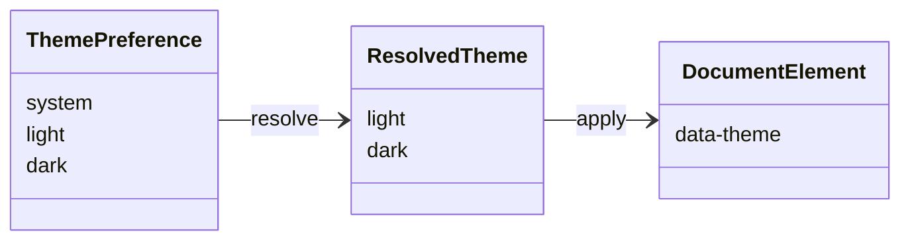

# REASONS Canvas · 主题色（亮 DeepSeek 蓝白 / 暗通用 slate）

- Date: 2026-10-08
- Status: synced
- Related analysis: `docs/spdd/analysis/20261008-theme-colors.md`
- Code anchors: `404home/src/assets/main.css`、`404home/src/App.vue`、`404home/src/components/AppHeader.vue`

---

## R · Requirements（为什么、范围）

### Business goal

让 404Home 视觉贴近主流 AI 产品：亮色为 DeepSeek 邻域蓝白，暗色为通用克制暗色；用户可一键切换并记住偏好，支撑试用与日常浏览。

### In scope

- CSS 双主题 token：`html[data-theme="light|dark"]`（由偏好解析）。
- 偏好三态：`system | light | dark`；**默认 `system`**（`prefers-color-scheme`）；系统变化时自动更新。
- Header 循环切换 系统→亮色→暗色；`localStorage` 键 `404home-theme-pref`。
- 全站共用（含 `/admin`）：解析结果写 `document.documentElement.dataset.theme`。
- 清除组件内纸感硬编码色，改为变量。
- 更新 `.cursor/rules/404home-conventions.mdc` UI 约定。

### Out of scope

- 多品牌色、用户自定义取色。
- 改字体栈（Fraunces 等另开）；不抄 DeepSeek logo/吉祥物。
- 后端主题 API；不引入 UI 主题库。

### Acceptance criteria

- [x] Header 可在 系统/亮色/暗色 间循环；页面同步变色。
- [x] 无偏好键时默认跟随系统；显式选择刷新后保持。
- [x] `system` 下 OS 亮暗切换时页面跟随（监听 `prefers-color-scheme`）。
- [x] 亮色无大面积暖米黄/绿底；主强调为蓝系。
- [x] 暗色无紫霓虹/强 glow；文字可读。
- [x] `/admin` 与前台同主题（同源 CSS 变量）。
- [x] 纸感硬编码色已清。

---

## E · Entities（领域对象）

| Entity | Fields / meaning | Persistence |
| --- | --- | --- |
| ThemePreference | `'system' \| 'light' \| 'dark'`（默认 system） | `localStorage['404home-theme-pref']` |
| ResolvedTheme | `'light' \| 'dark'` | 仅 DOM `data-theme` |
| ThemeTokens | `--bg` 等 | CSS only |

---

## A · Approach（方案与取舍）

### Chosen approach

1. `main.css`：`:root` / `[data-theme="light"]` 与 `[data-theme="dark"]` 定义完整 token；`body` 背景用 `var(--bg-page)` 等，禁止写死旧绿渐变。
2. `useTheme.js`：`initTheme` / `setTheme` / `cycleTheme`；偏好 `system|light|dark`；`system` 时监听 `matchMedia('(prefers-color-scheme: dark)')`；`index.html` 防闪按同样规则解析。
3. `AppHeader` 按钮展示当前偏好（系统/亮色/暗色），点击 `cycleTheme`。
4. 组件 scoped 样式用 CSS 变量。

### Token 定稿

**Light**

| Token | Value |
| --- | --- |
| `--bg` | `#F5F7FB` |
| `--bg-elevated` | `#FFFFFF` |
| `--bg-page` | `linear-gradient(180deg, #E8ECF1 0%, #F5F7FB 45%, #FFFFFF 100%)` |
| `--ink` | `#0F172A` |
| `--ink-soft` | `#475569` |
| `--line` | `#E5E7EB` |
| `--accent` | `#4D6BFE` |
| `--accent-soft` | `#EAEFFE` |
| `--hot` | `#C2410C` |
| `--new` | `#2563EB` |
| `--shadow` | `0 10px 30px rgba(15, 23, 42, 0.06)` |
| `--on-accent` | `#FFFFFF` |

**Dark**

| Token | Value |
| --- | --- |
| `--bg` | `#0F1117` |
| `--bg-elevated` | `#1A1D27` |
| `--bg-page` | `linear-gradient(180deg, #0B0D12 0%, #0F1117 50%, #12151C 100%)` |
| `--ink` | `#E8EAED` |
| `--ink-soft` | `#9AA0A6` |
| `--line` | `#2A2F3A` |
| `--accent` | `#6B85FF` |
| `--accent-soft` | `#1E2438` |
| `--hot` | `#F97316` |
| `--new` | `#60A5FA` |
| `--shadow` | `0 10px 28px rgba(0, 0, 0, 0.35)` |
| `--on-accent` | `#FFFFFF` |

### Alternatives considered

| Option | Pros | Cons | Decision |
| --- | --- | --- | --- |
| 仅前台主题 | 后台不动 | 割裂、Admin 仍纸感 | 否；全站 `html` |
| 三态+系统 | 更完整 | 需防闪与 media 监听 | **是**（2026-10-09） |
| class 切主题 | 常见 | 与现有属性习惯等价 | 用 `data-theme` |

### Analysis decisions applied

| ID | Choice |
| --- | --- |
| D1/D2 | 亮蓝白 / 暗 slate |
| D3 | 含 `/admin` |
| D4 | **默认 system**；三态；键 `404home-theme-pref` |
| Q4 | 字体本期不动 |
| Q5 | Trial 用全局 token，不单独主题文件 |

---

## S · Structure（结构与依赖）

### Modules / files to touch

| Path | Change |
| --- | --- |
| `404home/public/index.html`（或等价） | 可选：内联防闪脚本设 `data-theme` |
| `404home/src/composables/useTheme.js` | 新建主题 API |
| `404home/src/App.vue` 或 `main.js` | `initTheme()` |
| `404home/src/assets/main.css` | 双主题 token；body/`btn-primary`/`field`/`badge` 用变量 |
| `404home/src/components/AppHeader.vue` | 切换控件 + 去硬编码背景 |
| `404home/src/components/AppFooter.vue` | 硬编码背景 → 变量 |
| `404home/src/components/SearchBar.vue` | 硬编码 → 变量 |
| `404home/src/components/PasswordInput.vue` | `#fff` → `var(--bg-elevated)` |
| `404home/src/views/Trial.vue` | 绿系 rgba → 变量 |
| `404home/src/views/ToolDetail.vue` | 硬编码 rgba → 变量 |
| 其他 vue（按 grep） | 残留纸感色清扫 |
| `.cursor/rules/404home-conventions.mdc` | UI 约定改为蓝白+暗色 |

### Dependencies / order

1. Token + useTheme + 防闪  
2. Header 切换  
3. 全局 main.css 与组件硬编码清扫  
4. 约定文档  

---

## O · Operations（有序实现步骤）

### Op 1 · Theme runtime

- **Files**: `404home/src/composables/useTheme.js`；`404home/src/main.js` 或 `App.vue`；可选 `404home/public/index.html`
- **Do**: 实现 `getStoredTheme` / `applyTheme` / `initTheme` / `toggleTheme`；合法值仅 `light|dark`；非法或缺省 → `light`；写 `document.documentElement.dataset.theme` 与 localStorage。
- **Done when**: 控制台调用 `toggleTheme` 后 `html[data-theme]` 与 storage 一致；刷新保持。

### Op 2 · CSS tokens

- **Files**: `404home/src/assets/main.css`
- **Do**: 按上表写入 light/dark；`body { background: var(--bg-page); color: var(--ink); }`；`.btn-primary` 用 `var(--on-accent)`；`.field input` 等背景用 `var(--bg-elevated)`；badge 半透明可基于 accent/hot/new 或保持语义 rgba 但适配暗色可读。
- **Done when**: 仅改 `data-theme` 时整站底色与主按钮变色，无需刷新组件逻辑。

### Op 3 · Header toggle UI

- **Files**: `404home/src/components/AppHeader.vue`
- **Do**: `header-actions` 内加按钮（`aria-label` 切换主题）；样式用现有 `text-btn`/`btn-ghost`；去掉 `rgba(243, 239, 230, 0.9)` 等硬编码，改 `var(--bg)` / 半透明 elevated。
- **Done when**: 点击切换全页主题；Admin 布局若共用 html 亦变。

### Op 4 · Component color sweep

- **Files**: `AppFooter.vue`、`SearchBar.vue`、`PasswordInput.vue`、`Trial.vue`、`ToolDetail.vue` 及 grep 命中的其余文件
- **Do**: 纸感/写死白/绿 outline 改为 CSS 变量；暗色下搜索框、输入框、页脚不露白边。
- **Done when**: 仓库内 `404home/src` 无 `#f3efe6`、`#1f5b45`、`#fffdf8`、`rgba(31, 91, 69` 等旧色；亮暗目视无花斑。

### Op 5 · Conventions

- **Files**: `.cursor/rules/404home-conventions.mdc`
- **Do**: UI 条改为「亮色 DeepSeek 邻域蓝白 + 暗色 slate；经 CSS 变量与 `data-theme`；禁止紫霓虹模板」。
- **Done when**: 规则与实现一致。

---

## N · Norms（怎么写）

- Stack: Vue 3 Composition API；主题逻辑集中在 `useTheme.js`，组件不直接读写 localStorage。
- UI: 新颜色只进 CSS 变量；组件用 `var(--*)`。
- Naming: storage key `404home-theme`；属性 `data-theme`。
- A11y: 切换按钮可键盘聚焦；主按钮对比度达标。
- Testing: 手测首页、Trial、登录、Admin Dashboard 的亮/暗与刷新保持。

---

## S · Safeguards（不许做什么）

- Must not: 大面积复制 DeepSeek 品牌物料；暗色紫渐变/glow 模板；把主题存在服务端用户表（首期）。
- Must not: 只改首页不改 Trial/表单导致半套主题。
- Security: 无；勿把 theme 脚本写成可执行远端内容。
- Rollback: 还原 `main.css` token + 删除 `useTheme` 即可；storage 键可忽略。

---

## Sync log

| Date | Drift | Action |
| --- | --- | --- |
| 2026-10-08 | — | 初稿 active；待 `spdd-generate` |
| 2026-10-09 | 无 | `spdd-generate` 完成 Op1–5；AdminLayout 侧栏随 accent；Status → synced |
| 2026-10-09 | D4 改为三态默认系统 | 同步画布 + `useTheme`/`AppHeader`/防闪脚本；存储键改为 `404home-theme-pref` |
| 2026-10-09 | Header 文案循环不够直观；分类横向滚动 | Header 改为亮暗开关；`CategoryNav` 右侧箭头下展 |
